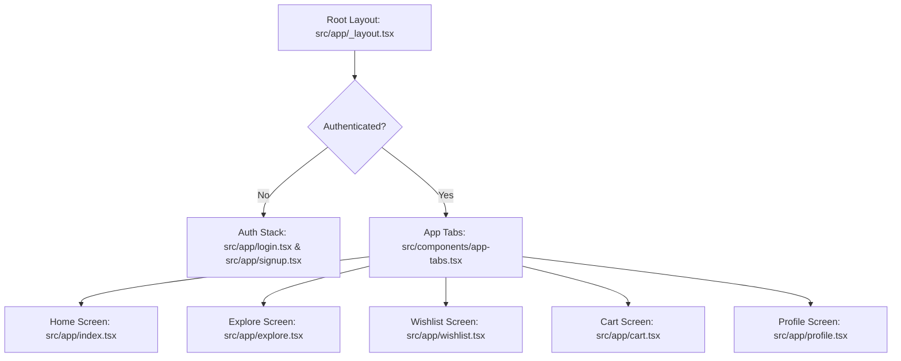
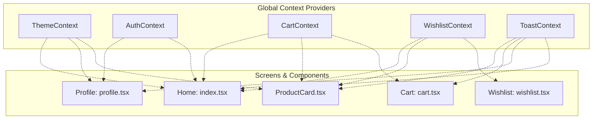
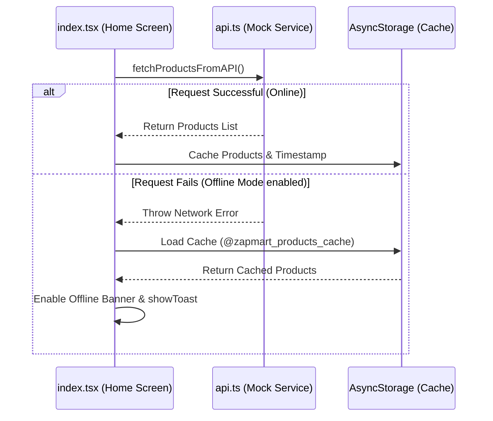

# ZapMart 🛒 — Universal React Native Expo Application

ZapMart is a modern, premium, universal (iOS, Android, and Web) grocery shopping application built using **Expo SDK 56**, **React Native**, **TypeScript**, and **React Native Reanimated**. It showcases advanced architectural patterns in state management, smooth animations, offline-first caching, and custom dark/light color schemes.

---

## 🏗️ Architecture & Overall Functioning

ZapMart is structured as a single-page-application layout wrapped with global context providers that manage the app's state, styling, notification routines, and toast systems. 

### 1. Navigation & Routing Flow
ZapMart leverages **Expo Router's** file-based routing. The entry point is `src/app/_layout.tsx`, which mounts the app's structural tree and dynamically redirects the user based on authentication status.



### 2. State & Context Data Flow
Global state is managed via React Contexts. Components select the state they need, and optimizations (like `useMemo` and `useCallback`) ensure that updates to one state (such as adding a toast) do not trigger unnecessary cascading re-renders in unrelated components.



### 3. Offline Caching & Sync Flow
ZapMart implements an offline-first caching system for products. When the app loads or is manually reloaded, it attempts to fetch from the mock API. If the connection fails (simulated in Profile settings), the screen automatically falls back to local AsyncStorage cache and triggers an offline banner.



---

## 📂 Project Structure & File-by-File Explanation

Here is the breakdown of the codebase, organized by directory:

### 1. Application Screens (`src/app/`)
These files represent the app's routes, handled automatically by Expo Router.

*   **[_layout.tsx](file:///c:/Users/DELL/react-native-docs/my-app/src/app/_layout.tsx)**: The root layout of the app. It initializes providers (Theme, Auth, Cart, Wishlist, Toast) and decides whether to render the Auth Stack (Login/Signup) or the Main App Tab bar. It also mounts the `AnimatedSplashOverlay`.
*   **[index.tsx](file:///c:/Users/DELL/react-native-docs/my-app/src/app/index.tsx)**: The Home screen ("ZapMart"). Displays products in a high-performance `FlatList`. Handles filtering by category, price, rating, sorting, and name searches. Integrates the `OfflineBanner` and cache retrieval.
*   **[cart.tsx](file:///c:/Users/DELL/react-native-docs/my-app/src/app/cart.tsx)**: The Cart screen. Lists items added to the cart, calculates invoice parameters (Subtotal, Delivery Fee, Tax, Grand Total), and manages quantity adjustments.
*   **[wishlist.tsx](file:///c:/Users/DELL/react-native-docs/my-app/src/app/wishlist.tsx)**: Displays the user's saved wishlist products in a list. Allows users to jump directly to the shopping catalog when empty.
*   **[profile.tsx](file:///c:/Users/DELL/react-native-docs/my-app/src/app/profile.tsx)**: The Profile screen. Contains toggles for **Dark Mode**, **Push Notifications**, and **Offline Simulation**, alongside profile detail edits (Name, Email, Phone) and Sign Out.
*   **[login.tsx](file:///c:/Users/DELL/react-native-docs/my-app/src/app/login.tsx)**: Sign In screen. Validates input credentials and calls the authentication provider. Features entering animations and scale-down button press effects.
*   **[signup.tsx](file:///c:/Users/DELL/react-native-docs/my-app/src/app/signup.tsx)**: Registration screen. Validates name, email, password, and password confirmation.
*   **[explore.tsx](file:///c:/Users/DELL/react-native-docs/my-app/src/app/explore.tsx)**: A informational tab containing collateral documentation for Expo features, such as routing, static assets, and animations.

### 2. State & Context Providers (`src/context/`)
*   **[theme-context.tsx](file:///c:/Users/DELL/react-native-docs/my-app/src/context/theme-context.tsx)**: Manages the active color palette. Listens to system OS appearance changes and provides manual override toggles. Values are memoized to avoid downstream layout updates.
*   **[auth-context.tsx](file:///c:/Users/DELL/react-native-docs/my-app/src/context/auth-context.tsx)**: Provides the state machine for user sessions (User profile details, token, loading state). Automatically re-hydrates authenticated sessions from AsyncStorage on startup.
*   **[cart-context.tsx](file:///c:/Users/DELL/react-native-docs/my-app/src/context/cart-context.tsx)**: Manages items inside the shopping cart. Dispatches cart modification events to a reducer and persists the updated items to local AsyncStorage via a optimized synchronization `useEffect` hook.
*   **[wishlist-context.tsx](file:///c:/Users/DELL/react-native-docs/my-app/src/context/wishlist-context.tsx)**: Provides operations to save and toggle products in the user's wishlist, automatically synced to AsyncStorage.
*   **[toast-context.tsx](file:///c:/Users/DELL/react-native-docs/my-app/src/context/toast-context.tsx)**: A global toast alert system. Renders layout-animated alerts at the top of the viewport (Success, Warning, Info, Error) with custom border cues and auto-dismiss timeouts.

### 3. Reusable Components (`src/components/`)
*   **[product-card.tsx](file:///c:/Users/DELL/react-native-docs/my-app/src/components/product-card.tsx)**: Renders a product item. Features spring animations on like/add clicks and is optimized via `React.memo` to eliminate redundant renders during list filters.
*   **[offline-banner.tsx](file:///c:/Users/DELL/react-native-docs/my-app/src/components/offline-banner.tsx)**: Displays network status warnings. It uses Reanimated height animations to transition smoothly between collapsed and expanded states.
*   **[skeleton-loader.tsx](file:///c:/Users/DELL/react-native-docs/my-app/src/components/skeleton-loader.tsx)**: Renders pulsating card placeholders while mock API calls load.
*   **[filter-modal.tsx](file:///c:/Users/DELL/react-native-docs/my-app/src/components/filter-modal.tsx)**: A modal overlay containing input filters (Category chip list, Min/Max price inputs, and rating selectors).
*   **[animated-icon.tsx](file:///c:/Users/DELL/react-native-docs/my-app/src/components/animated-icon.tsx)**: Contains splash transition assets and keyframe animations that fade out standard splash images.
*   **[app-tabs.tsx](file:///c:/Users/DELL/react-native-docs/my-app/src/components/app-tabs.tsx)**: Renders the native bottom tab bar navigator on mobile, dynamically styled with badges representing cart and wishlist counts.
*   **[app-tabs.web.tsx](file:///c:/Users/DELL/react-native-docs/my-app/src/components/app-tabs.web.tsx)**: Renders the responsive desktop-friendly navigation tab header when the app is run on the Web.
*   **[error-boundary.tsx](file:///c:/Users/DELL/react-native-docs/my-app/src/components/error-boundary.tsx)**: Catch-all React Error Boundary. When any component crashes in production, it displays a themed recovery screen rather than freezing the screen.
*   **[themed-text.tsx](file:///c:/Users/DELL/react-native-docs/my-app/src/components/themed-text.tsx)** & **[themed-view.tsx](file:///c:/Users/DELL/react-native-docs/my-app/src/components/themed-view.tsx)**: Primitive blocks styled with theme attributes.
*   **[web-badge.tsx](file:///c:/Users/DELL/react-native-docs/my-app/src/components/web-badge.tsx)** & **[external-link.tsx](file:///c:/Users/DELL/react-native-docs/my-app/src/components/external-link.tsx)**: Utility components that render web links.

### 4. Custom Hooks, Services, and Helpers
*   **[use-notifications.ts](file:///c:/Users/DELL/react-native-docs/my-app/src/hooks/use-notifications.ts)**: Simulates background system notifications. Runs an independent timer that fires promo codes and alerts the user if wishlist item prices drop.
*   **[use-theme.ts](file:///c:/Users/DELL/react-native-docs/my-app/src/hooks/use-theme.ts)**: A hook to fetch the current active theme color set.
*   **[api.ts](file:///c:/Users/DELL/react-native-docs/my-app/src/services/api.ts)**: The mock API fetcher. Retrieves local product listings with simulated network latency and throws errors when simulated offline mode is on.
*   **[theme.ts](file:///c:/Users/DELL/react-native-docs/my-app/src/constants/theme.ts)** & **[types.ts](file:///c:/Users/DELL/react-native-docs/my-app/src/constants/types.ts)**: Configuration tokens for styling (spacing, fonts, light/dark values) and type definitions.

---

## ⚡ React Native & Expo Concepts Explained

To help you understand the whole project, here is an explanation of the core technologies and patterns used:

### 1. File-based Navigation (Expo Router)
Traditionally, React Native routing required manual configuration using React Navigation (`Stack.Navigator`, `Tab.Navigator`). 
ZapMart uses **Expo Router**, which matches files in `src/app/` directly to screen routes.
*   `src/app/_layout.tsx` is the structural template that wraps all routes.
*   `src/app/index.tsx` represents `/` (Home).
*   `src/app/login.tsx` represents `/login`.
*   Expo Router automatically structures transition animations (slide-in on iOS, fade-in on Android, and instant routing on Web) according to native guidelines.

### 2. Context API & State Propagation
React Context is used to solve "prop-drilling" (passing props down many levels of children).
*   **Providers**: We wrap the app inside `<CartProvider>`, `<ThemeProvider>`, etc.
*   **Consumers**: Any component (like `ProductCard`) calls `useCart()` or `useTheme()` to fetch the state instantly.
*   **Optimization**: In React, whenever a context value object changes, *all* consumer components re-render. We prevent this by:
    1. Wrapping our handlers in `useCallback` (keeping their reference stable).
    2. Memoizing the context provider object using `useMemo` so it only changes when state values (like `state.items` or `themeMode`) change.

### 3. AsyncStorage Caching
Unlike web apps that use `localStorage` (which is synchronous and blocking), React Native uses **AsyncStorage**—an asynchronous, persistent, key-value storage system.
*   We use it to store themes, authentication tokens, and cached products.
*   We serialize complex objects to JSON strings when writing (`JSON.stringify(items)`), and parse them back when reading (`JSON.parse(stored)`).
*   **Safe Persistence Pattern**: In Cart and Wishlist contexts, we avoid complex closure calculations in handlers by using a single `useEffect` block that listens to `state.items` changes, safely writing updates to AsyncStorage only after startup load completes.

### 4. React Native Reanimated (Animations)
React Native has a built-in `Animated` API, but it runs on the JavaScript thread. If the JS thread is busy processing data, animations lag.
ZapMart uses **React Native Reanimated** (v4), which executes animations directly on the device's native UI thread using **Worklets** (JavaScript functions compiled to run in a separate thread).
*   **Shared Values**: Variables like `buttonScale` or `height` are declared with `useSharedValue()`.
*   **Springs & Timings**: We change their values using `withSpring()` or `withTiming()`, which calculate values smoothly on the UI thread.
*   **Layout Animations**: Components use `entering={FadeInDown}` or `exiting={SlideOutUp}`, allowing items to fade or slide smoothly as they are added or removed from lists.

### 5. SafeAreaView & Insets
Physical screens have notches, camera cutouts, and bottom gesture bars. 
ZapMart wraps its screens inside `<SafeAreaView>` (from `react-native-safe-area-context`). This measures the device's screen constraints and adds padding to the top and bottom, preventing texts or buttons from being clipped by the physical phone layout.

### 6. Error Boundaries
In React Native, an unhandled JS error causes the entire app to crash and exit. We wrap the app inside a custom `<ErrorBoundary>` class component. It uses `getDerivedStateFromError` to catch crashes in children, rendering a backup `CrashScreen` with recovery buttons, preventing app exits.

---

## 🚀 Running the Project

1. Install dependencies:
   ```bash
   npm install
   ```

2. Start the project:
   ```bash
   npx expo start
   ```

3. Open the app:
   * Press **a** to run on an Android Emulator.
   * Press **i** to run on an iOS Simulator.
   * Press **w** to run on the Web.
